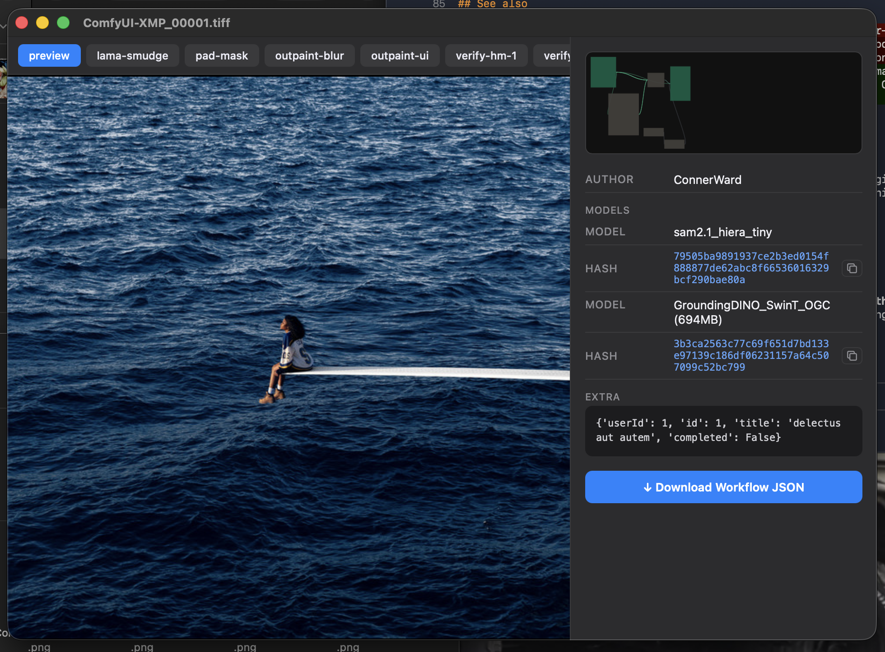

# comfy-viewer



macOS viewer for ComfyUI image metadata. Right-click a ComfyUI-generated PNG or TIFF in Finder → **Open With → ComfyQL** to see a split panel: image on the left, workflow metadata on the right.

Non-ComfyUI files are passed straight to Preview.app.

---

## Supported formats

| Format | Metadata source |
|---|---|
| PNG | `workflow` / `prompt` tEXt chunks |
| TIFF | XMP tag — `cfl:workflow`, `cfl:prompt`, `cfl:models`, `cfl:layers` |
| WEBP | XMP block |

**PNG** shows the embedded workflow graph and prompt. For richer output — named layers, model SHA256 hashes, arbitrary JSON metadata, and layer preview cycling — use the **[ComfyUI-SaveLayeredImage](https://github.com/connerkward/comfyui-save-image-xmp)** nodes which write layered TIFFs with full XMP provenance burned in.

---

## Requirements

- macOS 13+ (arm64)
- Xcode Command Line Tools (`xcode-select --install`)

## Install

```bash
git clone https://github.com/connerkward/comfy-viewer.git
cd comfy-viewer
make install
```

Builds `ComfyQL.app` → `~/Applications/` and registers with Launch Services.

> **First run:** macOS may warn about an unidentified developer. Right-click `ComfyQL.app` → Open, or:
> ```bash
> xattr -dr com.apple.quarantine ~/Applications/ComfyQL.app
> ```

## Usage

**Finder:** Right-click any ComfyUI PNG or TIFF → Open With → ComfyQL

**Terminal:**
```bash
open -a ComfyQL /path/to/image.png
```

## How it works

ComfyQL reads format-specific metadata chunks at open time and renders a split panel via WKWebView — image (left) + node summary and raw JSON tabs (right). If no ComfyUI metadata is found, the file opens in Preview.app.

## Build targets

| Target | Description |
|---|---|
| `make` | Build app |
| `make install` | Build + copy to `~/Applications/` |
| `make test` | Open most recent ComfyUI output PNG |
| `make uninstall` | Remove from `~/Applications/` |
| `make clean` | Remove build artifacts |

## Note on Quick Look

macOS 26 requires Developer ID code signing for Quick Look extensions, which blocks ad-hoc signed third-party plugins. ComfyQL works as a standalone "Open With" viewer instead — no signing required.
